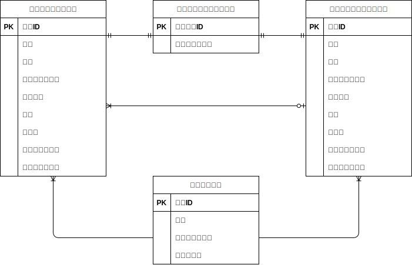

# FashionablyLate
<<<<<<< HEAD
=======

## 環境構築

- 1.ディレクトリの作成
- 2.Docker-compose.ymlの作成
- 3.Nginxの設定
- 4.PHPの設定
- 5.MySQLの設定
- 6.phpMyAdminの設定
- 7.docker-compose　コマンドでビルド
>>>>>>> bf48846d87a3f3751d6ded505f186f6a0989b1d3

## 環境構築
- 1.https://github.com/tetutora/contact-form-test
- 2.Dockerのビルド  docker-compose up -d --build
- 3.PHPコンテナの起動  docker-compose exec php bash
- 4.マイグレーションの実行  php artisan migrate
- 5.シーディングの実行  php artisan db:seed
- 6.完了

## 使用技術（実行環境）
- ・Laravel 8.x (PHP フレームワーク)
- ・MySQL 8.x (データベース)
- ・Nginx (Web サーバー)
- ・PHP 7.4 (PHP 実行環境)
- ・Docker (開発環境のコンテナ管理)

## ER図

## URL
- 開発環境: http://localhost